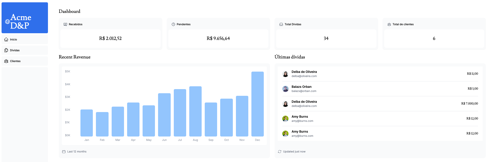

# Next.js Dashboard Project

A feature-rich dashboard application built with **Next.js**, **TypeScript**, and **Jest**, integrated with **Supabase** for debts management.



## 🚀 Features

- User-friendly dashboard interface.
- Integration with **Supabase** for secure and scalable database interactions.
- **TypeScript** for type-safe development.
- Server-side rendering (SSR) and API routes with **Next.js**.
- **Jest** for unit and integration testing.
- **TurboPack** for fast builds and development.

## 🛠️ Technologies Used

- **Next.js**: Framework for React with SSR and static site generation.
- **TypeScript**: Strongly typed JavaScript for better code quality.
- **Supabase**: Backend-as-a-Service for authentication and Postgres.
- **Jest**: Testing framework for unit and integration tests.
- **TurboPack**: High-performance JavaScript bundler.

---

## 📦 Installation

### Prerequisites

- [Node.js](https://nodejs.org/) (>= 16.8.0)
- [npm](https://www.npmjs.com/) or [pnpm](https://pnpm.io/) installed globally
- Supabase project setup with required environment variables.

### Setup

1. Clone the repository:

   ```bash
   git clone https://github.com/lcsdovalle/nextjs-dashboard.git
   cd nextjs-dashboard